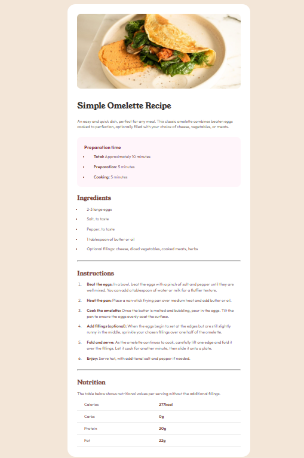

# Frontend Mentor - Recipe page solution

This is a solution to the [Recipe page challenge on Frontend Mentor](https://www.frontendmentor.io/challenges/recipe-page-KiTsR8QQKm). Frontend Mentor challenges help you improve your coding skills by building realistic projects. 

## Table of contents

- [Overview](#overview)
  - [The challenge](#the-challenge)
  - [Screenshot](#screenshot)
  - [Links](#links)
  - [Built with](#built-with)
  - [What I learned](#what-i-learned)
  - [Continued development](#continued-development)
  - [Useful resources](#useful-resources)
- [Author](#author)

**Note: Delete this note and update the table of contents based on what sections you keep.**

## Overview

### Screenshot

### Links

- Solution URL: https://github.com/BorysPresn/recipe-page
- Live Site URL: https://boryspresn.github.io/recipe-page/

### Built with

- Semantic HTML5 markup
- CSS custom properties

### What I learned
In this challenge, I learned how to create a responsive webpage using semantic HTML and CSS, ensuring accessibility and visual consistency across different screen sizes. I also gained experience in applying typographic principles and using modern CSS techniques like media queries to adapt layouts for mobile and desktop views. Additionally, I improved my skills in structuring and styling content according to design specifications.

### Continued development

I want to continue to focus on semantics and new CSS features

### Useful resources

https://www.w3schools.com/css/

## Author
Borys Presniak
https://github.com/BorysPresn/

